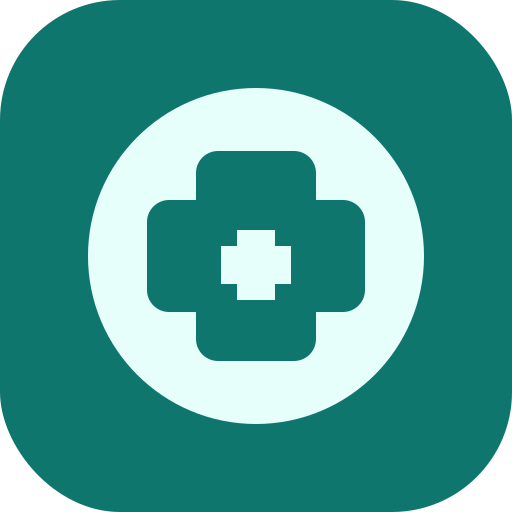
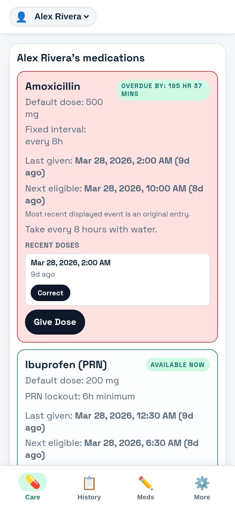
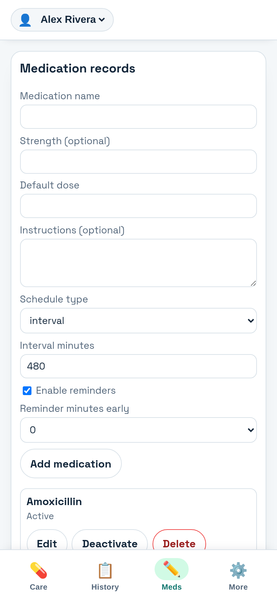
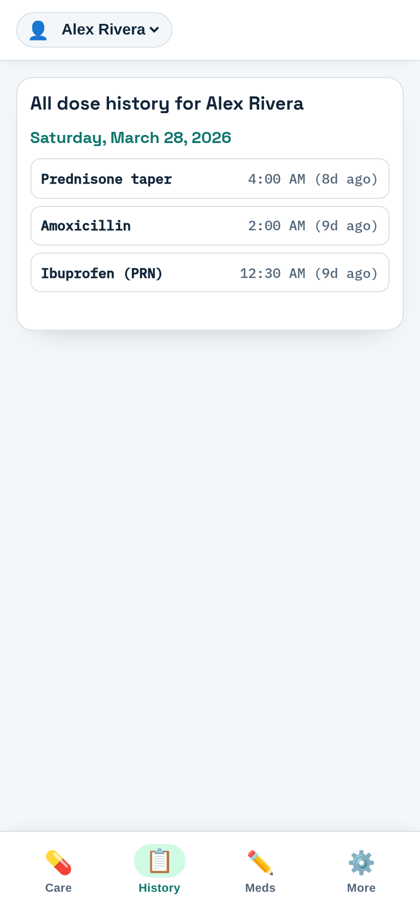

<div align="center">
  
  <h1>MedMinder</h1>
  <p>A beautiful, local-first progressive web app for tracking medication schedules.</p>
</div>

Med-Minder is a highly responsive, offline-first medication timing tracker built for caregivers. It eliminates the cognitive load of tracking complex medication schedules (intervals, fixed times, PRN, and tapers) by answering a few simple questions at a glance:

- **When is this medication next eligible?**
- **Is it eligible now?**
- **What doses were already given?**
- **When should I be reminded?**

Built to be installed directly to your phone's home screen as a PWA, it behaves exactly like a native app with zero cloud bloat.

## 📲 How to Use MedMinder

<div align="center">
   <p><strong><a href="https://medminder.superdavelab.com" target="_blank" rel="noopener noreferrer">🟢 Try the Live App!</a></strong></p>
</div>

The link above leads to the fully functional live production build. To get started:

1. **Install to your device**: Open the live link on your mobile browser (Safari/Chrome) and select **"Add to Home Screen"**. It will install directly to your device as a native-capable app.
2. **Make it yours**: A sample patient ("Alex Rivera") is loaded by default so you can see how things work. *It is completely safe to delete this patient and add your own!*
3. **Your data is your own**: Because MedMinder is architected to be completely local-first, **everything you log is saved exclusively locally on your device**. Deleting the sample data only clears your own local cache, and your personal health data will *never* be sent to our servers.

### 📱 Screenshots

<div style="display: flex; gap: 10px; flex-wrap: wrap;">
  
  
  
</div>

## 🚀 Features

- **Schedule-Aware Status Engine**: Automatically calculates if a medication is "Eligible now", "Due soon", "Too early", or "Overdue" natively within the browser format.
- **Complex Schedules Supported**: Fully supports `interval` (e.g. every 6 hours), `fixed_times` (e.g. 08:00 and 20:00), `prn` (as needed), and complex `taper` schedules!
- **Patient-first Workflow**: Dedicated Patients management, patient-scoped Meds view, and fast add/edit medication workflows optimized for mobile care rounds.
- **Local-first & Privacy-focused**: Your data never leaves your device. Everything is securely stored in IndexedDB (`med-minder-db`).
- **Complete History & Auditing**: See exactly what was given when, and log corrections that properly supersede accidental entries.
- **Smart Notifications**: Per-medication notification toggles, optional early notice (10/15 min), PRN default-off behavior, and overdue reminders.
- **Noise Reduction for Caregivers**: Notifications are grouped per patient so multiple due medications can be delivered as a single alert.
- **In-App Alarm Mode**: For interval and fixed-time meds, enable alarm mode to trigger repeating in-app sound/vibration with acknowledge/snooze actions when due now.
- **Data Portability**: Full JSON backup export and import logic allows you to safely copy data across devices.

## ⏰ Alarm Behavior (Important)

MedMinder now supports an in-app alarm experience for eligible schedules (`interval` and `fixed_times`):

- Per-medication alarm toggle in **Meds**
- Repeating in-app sound + vibration pulses when due now
- Quick **Acknowledge** and **Snooze (5 min)** actions
- **Test alarm** button in **More → App Settings**

Because this is a browser/PWA app, true OS-native background alarm scheduling is limited by platform/browser rules. For reliability when the app is backgrounded, keep browser notifications enabled as well.

## 🔔 Reminder Limits

MedMinder can be a very capable installed PWA, but it is still subject to web platform limits:

- The app cannot schedule exact OS-level alarms the way a fully native mobile app can.
- Local browser notifications are best-effort and may be delayed or missed if the browser suspends the app, the device is aggressively power-managed, or notification permissions are disabled.
- In-app sound and vibration alarms are strongest while the app is open, installed, and allowed to stay active in the foreground.
- Offline/local-first reminder behavior is intentionally self-contained, which means it does not have a cloud scheduler backing it up.

For best current reliability:

- Install the app to the home screen.
- Enable browser notifications.
- Use the in-app alarm option for interval and fixed-time medications.
- Use Prevent sleep during active care windows when appropriate.

Current reminder behavior (implemented):

- Deactivated medications never generate notification candidates.
- Medications with notifications disabled never generate notification candidates.
- `due-soon` only applies when early reminder minutes is set to 10 or 15.
- PRN defaults notifications to off when reminder settings are unset.
- PRN emits a single `due-now` notification per eligibility window (no `due-soon` or recurring overdue buckets).
- Overdue notifications use a 30-minute default interval and support per-medication override in domain data.
- For policy "Push first, then email fallback", fallback email is sent only when push delivers to zero subscriptions for the account. If any device receives push, fallback email is skipped.

## ☁️ Planned Premium Reminder Relay

To improve reliability beyond what a plain PWA can guarantee, MedMinder is expected to support an optional premium reminder relay service.

Planned behavior:

- Send one **Due now** reminder per medication when reminders are enabled.
- Deliver that reminder through at least two channels:
   - Web push to the installed MedMinder app
   - Email
- Support optional SMS later.

Important product tradeoff:

- The core app can remain local-first.
- The premium reminder relay cannot remain purely local-first, because the backend must know about reminder-enabled medications and schedule changes in order to deliver backup notifications.
- If a user opts into the premium service, reminder-relevant patient and medication updates will need to sync to the backend whenever they change.

This is the practical ceiling for a web-based app: a PWA plus a server-backed reminder relay can be substantially more robust than local-only browser reminders, but it still is not the same as native device alarm APIs.

## 🗺️ Roadmap

For planned enhancements and prioritization notes, see [docs/roadmap.md](docs/roadmap.md).

## 🛠️ Setup & Development

MedMinder is built heavily on React and Vite for blisteringly fast performance.

**Requirements:**
- Node.js 20+
- npm 10+

**Install and run:**

1. Install dependencies:
   ```bash
   npm install
   ```
2. Start the hot-reloading development server:
   ```bash
   npm run dev
   ```
3. Run test suite:
   ```bash
   npm test
   ```
4. Build for production:
   ```bash
   npm run build
   ```

### Local auth API (optional, for account mode testing)

The app now includes a local auth API stub backed by MySQL/MariaDB for account create/sign-in testing.

1. Ensure `.env` exists (or copy from `.env.example`) with auth DB settings.
2. Start the auth API:
   ```bash
   npm run api:dev
   ```
3. In a second terminal, start the app:
   ```bash
   npm run dev
   ```
4. Open **More -> Account (optional cloud sync)** and test:
   - Create account
   - Sign in
   - Sign out

Account-mode sync behavior (current implementation):

- On **Create account**, the app bootstraps your current local patient/medication/dose data to the server.
- After bootstrap succeeds, local clinical tables are reset and rehydrated from server state.
- On **Sign in**, local clinical tables are reset and replaced with server state.
- While signed in, local data changes are mirrored to the server whenever the app refreshes the patient view after a write.
- On **Sign out**, local clinical data is cleared.

To clear local auth users/sessions and start fresh:

```bash
npm run auth:db:reset
```

The Vite dev server proxies `/api/*` to `http://localhost:8787` by default.

## 🔒 Data and Privacy

Because MedMinder is a caregiver timing tool, privacy and reliability are paramount:
- **No Backend**: There are no servers processing your data.
- **Offline Capable**: As a registered PWA, MedMinder functions without an internet connection.
- **Manual Sync**: Data is tied to the current browser profile unless you use the built-in backup and restore tooling to move it.

Current note:
- The optional premium reminder relay described above is planned work, not current app behavior. If added, it will be opt-in and will require sending reminder-related data to a backend service.

### Disclaimer
*This app is a caregiver timing tool. It does not provide diagnosis, dosage recommendations, or treatment advice.*

## 📄 License

This project is licensed under the MIT License - see the LICENSE file for details.
